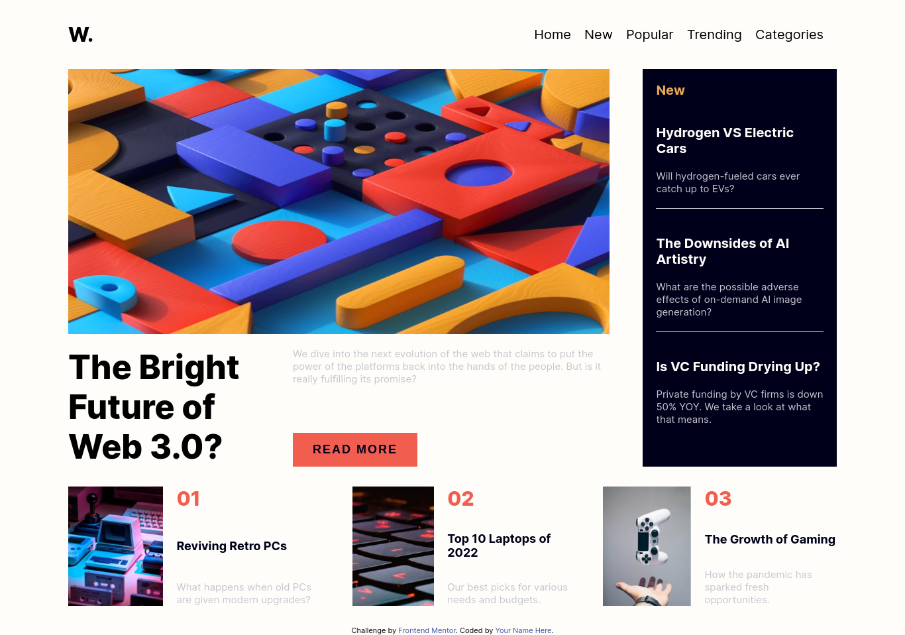

# Frontend Mentor - News homepage solution

This is a solution to the [News homepage challenge on Frontend Mentor](https://www.frontendmentor.io/challenges/news-homepage-H6SWTa1MFl). Frontend Mentor challenges help you improve your coding skills by building realistic projects.

## Table of contents

- [Overview](#overview)
  - [The challenge](#the-challenge)
  - [Screenshot](#screenshot)
  - [Links](#links)
- [My process](#my-process)
  - [Built with](#built-with)
  - [What I learned](#what-i-learned)
  - [Continued development](#continued-development)
- [Author](#author)

## Overview

### The challenge

Users should be able to:

- View the optimal layout for the interface depending on their device's screen size
- See hover and focus states for all interactive elements on the page

### Screenshot



### Links

- Solution URL: [Frontend mentor solution URL](https://your-solution-url.com)
- Live Site URL: [Github pages live site URL](https://your-live-site-url.com)

## My process

### Built with

- Semantic HTML5 markup
- CSS custom properties
- Flexbox
- Mobile-first workflow
- JS

### What I learned

```html
<header role="banner">
  <nav aria-label="Main Navigation" role="navigation">
    <a href="#" class="logo" aria-label="Home" title="W">W.</a>
    <ul class="menu" role="menu" role="menu">
      <button
        class="menu-close"
        aria-label="Close Menu"
        aria-controls="menu"
        aria-expanded="false"
      >
        <svg
          width="32"
          height="31"
          xmlns="http://www.w3.org/2000/svg"
          role="img"
          aria-label="Close Menu"
        >
          <g fill="#00001A" fill-rule="evenodd">
            <path d="m2.919.297 28.284 28.284-2.122 2.122L.797 2.419z" />
            <path d="M.797 28.581 29.081.297l2.122 2.122L2.919 30.703z" />
          </g>
        </svg>
      </button>
      <li class="menu-item" role="menuitem">
        <a class="menu-link" href="#">home</a>
      </li>
      <li class="menu-item" role="menuitem">
        <a href="#" class="menu-link">new</a>
      </li>
      <li class="menu-item" role="menuitem">
        <a href="#" class="menu-link">popular</a>
      </li>
      <li class="menu-item" role="menuitem">
        <a href="#" class="menu-link">trending</a>
      </li>
      <li class="menu-item" role="menuitem">
        <a href="#" class="menu-link">categories</a>
      </li>
    </ul>
    <button
      class="menu-btn"
      aria-label="Open Menu"
      aria-controls="menu"
      aria-expanded="false"
    >
      <svg
        width="40"
        height="17"
        xmlns="http://www.w3.org/2000/svg"
        role="img"
        aria-label="Open Menu"
      >
        <g fill="#00001A" fill-rule="evenodd">
          <path d="M0 0h40v3H0zM0 7h40v3H0zM0 14h40v3H0z" />
          <path d="M0 0h40v3H0z" />
        </g>
      </svg>
    </button>
  </nav>
</header>
```

```css
.article-body {
  flex-basis: 60%;
  display: flex;
  flex-direction: column;
  justify-content: space-between;
  gap: 1rem;

  h3 {
    color: var(--Soft-red);
    font-size: 3rem;
    font-weight: 800;
  }
  h4 {
    color: var(--Very-dark-blue);
    font-size: 1.8rem;
    &:hover {
      color: var(--Soft-red);
      cursor: pointer;
    }
  }
  p {
    color: var(--Grayish-blue);
  }
}
```

```js
menuButton.addEventListener("click", () => {
  menu.classList.add("show");
  overlay.classList.add("show");
});
closeButton.addEventListener("click", () => {
  menu.classList.remove("show");
  overlay.classList.remove("show");
});
```

### Continued development

I have continued development on this project. I'm currently working on the challenge's solution and am using it as a starting point for this project.

## Author

- Website - [my portfolio](https://abdelmonaem-portfolio.vercel.app/)
- Frontend Mentor - [@coder-abdo](https://www.frontendmentor.io/profile/coder-abdo)
